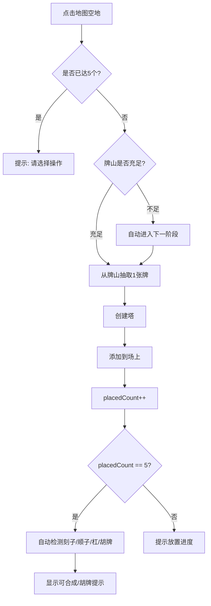
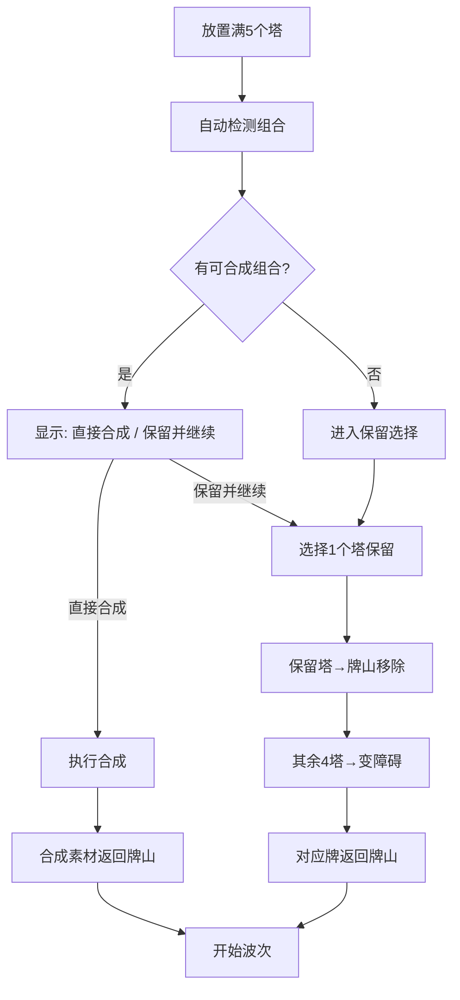

# 麻将塔防 (Mahjong TD) - 技术规格文档

**版本**: v2.0
**最后更新**: 2026-07-17
**状态**: Draft (基于 MAHJONG_TD_V2_DESIGN.md 重构)
**维护者**: AI Assistant

---

## 1. 项目概述

### 1.1 游戏简介

- **名称**: 麻将塔防 (Mahjong TD)
- **类型**: 策略塔防 + 麻将合成
- **技术栈**: React 18 + TypeScript + Vite + Canvas 2D
- **核心特色**:
  - 牌山抽卡系统(108张数牌)
  - 基于麻将规则的合成系统(刻子→风牌, 杠→中发白)
  - 胡牌检测与全局Buff系统
  - 五行属性系统(金木水火土)
  - 被动增益(未合成的刻子/顺子在场增益)

### 1.2 设计理念 (V2核心变更)

- **点数无差异**: 1-9点数仅影响视觉, 不影响数值, 所有同花色点数塔属性完全相同
- **无品质系统**: 所有塔属性固定, 无生张/熟张/老张/绝张
- **基础牌无特殊效果**: 基础牌只提供基础攻击定位, 特效主要来自风牌/中发白/Buff系统
- **牌山循环**: 未保留的牌返回牌山, 合成素材返回牌山, 支持50+波
- **胡牌策略**: 在合成强化单塔与保留组合获取全局增益之间做战术选择

### 1.3 项目结构

```
src/
├── components/          # UI组件
│   ├── GameCanvas.tsx       # Canvas渲染组件
│   ├── GameUI.tsx           # 游戏UI界面
│   └── TowerDefenseGame.tsx # 主游戏容器
├── config/              # 配置文件
│   ├── towers.ts        # 塔配置和合成规则
│   ├── enemies.ts       # 敌人配置
│   ├── waves.ts         # 波次配置
│   └── map.ts           # 地图配置
├── hooks/               # React Hooks
│   ├── useGameEngine.ts     # 游戏引擎核心
│   ├── useGameLoop.ts       # 游戏循环
│   └── usePathfinding.ts    # BFS寻路
├── types/               # TypeScript类型定义
│   └── game.ts          # 游戏核心类型
├── utils/               # 工具函数
│   ├── MahjongDeck.ts   # 牌山管理类
│   ├── huDetector.ts    # 胡牌检测算法
│   ├── audio.ts         # 音效管理
│   └── pathfinding.ts   # 寻路算法
└── main.tsx             # 应用入口
```

---

## 2. 核心系统设计

### 2.1 牌山系统 (MahjongDeck)

**文件位置**: `src/utils/MahjongDeck.ts`

#### 牌库构成

- **总数**: 108张数牌
- **万子**: 36张 (1-9各4张)
- **条子**: 36张 (1-9各4张)
- **筒子**: 36张 (1-9各4张)
- **不含**: 字牌(东南西北中发白), 花牌(梅兰竹菊)

#### 抽牌与还牌规则

- **抽牌**: 每波放置5个塔时, 从牌山随机抽取5张牌
- **保留**: 玩家选择1个塔保留 → 对应牌从牌山**永久移除**(进入"已使用区")
- **变障碍**: 其余4个塔变成障碍物 → 对应牌**返回牌山**(可再次抽取)
- **合成**: 合成消耗的素材牌 → **全部返回牌山**

#### 牌山耗尽处理

```
IF 牌山剩余牌数 < 5 THEN
  提示: "敌人进化进入阶段二!"
  给予一副新的完整牌山(108张)
  敌人数值增强(血量×1.5, 速度×1.2)
END IF
```

**预计支持波数**:

- 每波净消耗1张牌(放5选1)
- 108张 ÷ 1张/波 = 108波
- 考虑合成素材返回, 实际可支持**50+波**
- 50波后开启无尽模式

#### 核心API

```typescript
class MahjongDeck {
  private deck: MahjongTile[]
  private usedTiles: MahjongTile[]

  constructor()

  draw(count: number): MahjongTile[]
  returnToDeck(tiles: MahjongTile[]): void
  removeFromDeck(tile: MahjongTile): void
  remaining(): number
  needsRefill(): boolean
  refill(): void
  getPhase(): number
}
```

#### 洗牌机制

- **算法**: Fisher-Yates洗牌
- **触发**: 初始化、`returnToDeck()`归还牌后、`refill()`时

---

### 2.2 基础牌属性 (V2统一数值)

**文件位置**: `src/config/towers.ts`, `src/types/game.ts`

#### 核心原则

- **点数仅影响视觉**, 不影响数值
- 所有万1~万9属性完全相同, 条1~条9属性完全相同, 筒1~筒9属性完全相同
- 点数仅用于判断刻子/顺子/杠/胡牌
- **基础牌无特殊效果**, 所有特效主要来自风牌/中发白/Buff系统

#### 花色定位

| 花色              | 攻击力  | 攻速       | 攻击目标 | 特殊效果 |
| ----------------- | ------- | ---------- | -------- | -------- |
| **万子** 🔴 | 高 (12) | 中 (1.0/s) | 单体     | 无       |
| **条子** 🟢 | 低 (6)  | 快 (1.8/s) | 单体     | 无       |
| **筒子** 🔵 | 中 (8)  | 中 (1.2/s) | 3目标    | 无       |

#### 基础塔数值配置

```typescript
BASE_TOWER_STATS = {
  wan: { damage: 12, attackSpeed: 1.0, range: 120 },
  tiao: { damage: 6, attackSpeed: 1.8, range: 130 },
  tong: { damage: 8, attackSpeed: 1.2, range: 110, multiTarget: 3 }
}
```

#### ~~品质系统~~ ❌ 已移除

- **无品质系统**, 所有塔属性固定
- 无生张/熟张/老张/绝张
- 无品质加成倍率
- 无按点数递增的属性表

---

### 2.3 合成系统

**文件位置**: `src/hooks/useGameEngine.ts`

#### 合成总览

| 合成类型 | 输入              | 输出/用途         | 说明                                               |
| -------- | ----------------- | ----------------- | -------------------------------------------------- |
| 刻子     | 3张同花色同点数   | 风牌              | 独立风牌塔 + 五行属性                              |
| 杠       | 4张同花色同点数   | 中发白            | 超级增强版塔                                       |
| 顺子     | 3张同花色连续点数 | 低优先级/被动增益 | V2未定义明确高级塔产物, 通常建议保留以获取被动增益 |

#### 2.3.1 刻子 → 风牌 (三才四风)

**合成规则**:

```typescript
// 刻子定义: 3张同花色同点数
万子刻子 (如 万5+万5+万5) → 西风
条子刻子 (如 条3+条3+条3) → 北风
筒子刻子 (如 筒7+筒7+筒7) → 南风
幺九刻子 (万1/9, 条1/9, 筒1/9的刻子) → 东风
```

**风牌能力**:

- 独立的风牌塔, 占据格子
- 基础属性继承原刻子的平均值 × 1.5
- 五行特性预留接口, 后续补充具体效果

```typescript
WIND_TOWER_MULTIPLIER = 1.5
```

#### 2.3.2 五行属性系统

**公式**: `(数字之和) % 5 → [金木水火土]`

```typescript
0 → 金 (Metal)
1 → 木 (Wood)
2 → 水 (Water)
3 → 火 (Fire)
4 → 土 (Earth)
```

**计算示例**:

- 万3刻子: (3+3+3) % 5 = 9 % 5 = 4 → 土属性
- 条7刻子: (7+7+7) % 5 = 21 % 5 = 1 → 木属性
- 筒9刻子: (9+9+9) % 5 = 27 % 5 = 2 → 水属性

**预留接口**:

```typescript
const WIND_ABILITIES = {
  dong: { /* 东风特性 */ },
  nan: { /* 南风特性 */ },
  xi: { /* 西风特性 */ },
  bei: { /* 北风特性 */ }
}

const ELEMENT_BONUS = {
  jin: { /* 金属性 */ },
  mu: { /* 木属性 */ },
  shui: { /* 水属性 */ },
  huo: { /* 火属性 */ },
  tu: { /* 土属性 */ }
}
```

#### 2.3.3 杠 → 中发白 (三元牌)

**合成规则**:

```typescript
// 杠定义: 4张同花色同点数
万子杠 → 红中 (Red Dragon)
条子杠 → 发财 (Green Dragon)
筒子杠 → 白板 (White Dragon)
```

**中发白能力 (超级增强版)**:

| 三元牌         | 基础来源 | 攻击力   | 攻速         | 范围       | 特殊效果                |
| -------------- | -------- | -------- | ------------ | ---------- | ----------------------- |
| **红中** | 万子     | 12×3=36 | 1.0×2=2.0/s | 120×2=240 | 溅射半径50, 溅射伤害50% |
| **发财** | 条子     | 6×3=18  | 1.8×2=3.6/s | 130×2=260 | 毒素伤害5/秒, 持续5秒   |
| **白板** | 筒子     | 8×3=24  | 1.2×2=2.4/s | 110×2=220 | 减甲效果-5护甲, 持续3秒 |

```typescript
DRAGON_MULTIPLIER = {
  damage: 3.0,
  attackSpeed: 2.0,
  range: 2.0
}
```

#### 2.3.4 复合合成 ❌ 已移除

V2设计中不包含"合成塔 + 任意基础塔 = 超级塔"的复合合成机制。旧版的超级刻子、超级顺子、超级红中、超级发财、超级白板均不再作为当前规格的一部分。

---

### 2.4 胡牌检测与Buff系统

**文件位置**: `src/utils/huDetector.ts`

#### 检测时机

- 每次放置5个塔后自动检测
- 基于场上**所有显示的塔**(包括之前保留的)

#### 胡牌条件

```typescript
// 基本胡牌结构: 4面子 + 1雀头
interface HuPattern {
  type: string
  fan: number
  buff: BuffEffect
}
```

#### 番型Buff列表

| 番型       | 番数       | Buff效果              |
| ---------- | ---------- | --------------------- |
| 立直       | 1番        | 全塔攻速+10%          |
| 断幺九     | 1番        | 全塔伤害+15%          |
| 平和       | 1番        | 全塔范围+10%          |
| 一杯口     | 1番        | 暴击率+10%            |
| 对对和     | 2番        | 全塔伤害+30%          |
| 三色同刻   | 2番        | 穿透+2                |
| 三暗刻     | 2番        | 暴击伤害+50%          |
| 混一色     | 3番        | 同花色伤害+50%        |
| 纯全带幺九 | 3番        | 1/9点数塔伤害+40%     |
| 清一色     | 6番        | 全塔伤害×2, 攻速+30% |
| 国士无双   | 役满(13番) | 全属性×3             |
| 大三元     | 役满(13番) | 中发白威力×4         |
| 四暗刻     | 役满(13番) | 100%暴击              |

#### 番型配置代码

```typescript
const HU_PATTERNS = {
  '立直': { fan: 1, buff: { allAttackSpeed: 0.1 } },
  '断幺九': { fan: 1, buff: { allDamage: 0.15 } },
  '平和': { fan: 1, buff: { allRange: 0.1 } },
  '一杯口': { fan: 1, buff: { critChance: 0.1 } },
  '对对和': { fan: 2, buff: { allDamage: 0.3 } },
  '三色同刻': { fan: 2, buff: { pierce: 2 } },
  '三暗刻': { fan: 2, buff: { critMultiplier: 0.5 } },
  '混一色': { fan: 3, buff: { sameSuitDamage: 0.5 } },
  '纯全带幺九': { fan: 3, buff: { edgeNumberBonus: 0.4 } },
  '清一色': { fan: 6, buff: { allDamage: 1.0, attackSpeed: 0.3 } },
  '国士无双': { fan: 13, buff: { allStats: 2.0 } },
  '大三元': { fan: 13, buff: { dragonTowerPower: 3.0 } },
  '四暗刻': { fan: 13, buff: { allCrit: 1.0 } },
}
```

#### 触发流程

```typescript
1. 放置5个塔后
2. 检测场上是否有胡牌组合
3. IF 有胡牌 THEN
     弹出特效: "🎉 胡了! [番型名称] ([番数]番)"
     应用对应Buff (永久生效, 只要胡牌组合还在场上)
   END IF
```

#### Buff持续时间

- **无时间限制**, 只要组成胡牌的塔还在场上就持续生效
- 如果胡牌组合中的某个塔被合成或移除, Buff消失

#### 胡牌检测算法

```typescript
export function detectHuPattern(towers: Tower[]): HuPattern | null {
  const tiles = towers.map(t => t.tile)
  const tileCount = countTiles(tiles)

  const patterns = [
    checkQingYiSe(tileCount),
    checkDuanYaoJiu(tileCount),
    checkDuiDuiHu(tileCount),
    checkSanSeTongKe(tileCount),
    // ... 其他番型
  ]

  return patterns.find(p => p !== null) || null
}
```

---

### 2.5 被动增益系统 (微弱全场增益)

#### 触发条件

- 场上存在刻子/顺子组合, 但玩家**未选择合成**
- 每有一组刻子/顺子, 提供一层Buff

#### 增益效果

```typescript
// 刻子在场被动
const KEZI_PASSIVE_PER_GROUP = {
  allDamage: 0.05,
  critChance: 0.02
}

// 顺子在场被动
const SHUNZI_PASSIVE_PER_GROUP = {
  allAttackSpeed: 0.03,
  allRange: 0.02
}
```

#### 叠加规则

- 线性叠加, 最多5层
- 示例: 场上有2个刻子 + 1个顺子 → allDamage +10%, critChance +4%, attackSpeed +3%, range +2%

---

### 2.6 Buff效果类型定义

```typescript
export interface BuffEffect {
  allDamage?: number
  allAttackSpeed?: number
  allRange?: number
  critChance?: number
  critMultiplier?: number
  pierce?: number
  splashRadius?: number
  poisonDamage?: number
  armorReduction?: number
  stunChance?: number
  sameSuitDamage?: number
  edgeNumberBonus?: number
  allStats?: number
  dragonTowerPower?: number
  allCrit?: number
}
```

---

### 2.7 Debuff系统

**文件位置**: `src/types/game.ts`, `src/hooks/useGameEngine.ts`

#### Debuff类型定义

```typescript
interface Enemy {
  debuffs?: Array<{
    type: 'armor_reduction' | 'burn' | 'poison'
    value: number
    duration: number
    stacks?: number
    source?: string
  }>
}
```

#### 三元牌Debuff来源

| Debuff    | 来源 | 效果                    |
| --------- | ---- | ----------------------- |
| 灼烧/溅射 | 红中 | 溅射半径50, 溅射伤害50% |
| 毒素      | 发财 | 毒素伤害5/秒, 持续5秒   |
| 减甲      | 白板 | 减甲效果-5护甲, 持续3秒 |

---

### 2.8 敌人系统

**文件位置**: `src/config/enemies.ts`, `src/types/game.ts`

#### 敌人类型

| 类型         | HP | 速度 | 护甲 | 魔抗 | 奖励 | 颜色    | 半径 |
| ------------ | -- | ---- | ---- | ---- | ---- | ------- | ---- |
| 普通 (basic) | 8  | 60   | 0    | 0    | 5    | #FF6B6B | 12px |
| 快速 (fast)  | 6  | 100  | 0    | 0    | 7    | #FFA500 | 10px |
| 坦克 (tank)  | 20 | 40   | 5    | 20%  | 15   | #8B0000 | 14px |

#### 牌山耗尽时的敌人增强

当牌山补充(阶段二)时:

- 血量 × 1.5
- 速度 × 1.2

---

## 3. 交互流程

### 3.1 回合流程 (V2更新)

```typescript
1. 从牌山抽取5张牌 → 放置5个基础塔
2. 自动检测:
   - 是否有刻子/顺子/杠组合?
   - 是否有胡牌组合?
3. 如果有可合成组合:
   - 显示"直接合成"按钮 (可选)
   - 显示"保留并继续"按钮
4. 如果选择"保留并继续":
   - 弹出决策对话框: 选择1个塔保留
   - 保留的塔 → 从牌山移除
   - 其余4个塔 → 变成障碍, 牌返回牌山
5. 如果选择"直接合成":
   - 执行合成逻辑
   - 合成素材返回牌山
   - 跳过保留阶段
6. 开始波次
```

### 3.2 合成优先级

```
最高优先级: 胡牌检测 (如果达成, 强烈建议不合成, 保留Buff)
次高优先级: 杠 → 中发白 (强力单塔)
中等优先级: 刻子 → 风牌 (中等强度)
最低优先级: 顺子 (较弱, 通常不建议合成)
```

### 3.3 放置流程



### 3.4 决策流程



### 3.5 障碍物管理

**功能**: 未选择的塔变为障碍物, 可手动消除

**预期流程**:

1. 用户点击障碍物格子
2. 弹出确认对话框
3. 将格子类型改为`'empty'`
4. 重新计算路径

---

## 4. UI设计

### 4.1 牌山显示

```typescript
<div className="deck-info">
  <span>🀄 牌山剩余: {deck.remaining()}张</span>
  {deck.needsRefill() && <span className="warning">⚠️ 即将进入阶段二!</span>}
</div>
```

### 4.2 可合成提示

```typescript
if (detectKezi(currentBatch)) {
  showHint('✨ 检测到刻子! 可直接合成风牌')
}

if (detectHuPattern(allTowers)) {
  showSpecialEffect('🎉 胡了! [番型名称]')
}
```

### 4.3 Buff状态显示

```typescript
<div className="active-buffs">
  {activeBuffs.map(buff => (
    <div key={buff.id} className="buff-icon">
      {buff.icon} {buff.name} (+{buff.value}%)
    </div>
  ))}
</div>
```

### 4.4 决策对话框

```
┌─────────────────────────────────────┐
│      选择操作                        │
─────────────────────────────────────┤
│  ✨ 检测到: 万5刻子 → 可合成西风     │
│                                     │
│  [🔥 直接合成]  [📌 保留并继续]      │
│                                     │
│  提示: 如果已达成胡牌, 建议保留Buff  │
─────────────────────────────────────┘
```

### 4.5 Canvas渲染

**绘制顺序**:

1. 清空画布
2. 绘制网格(地形)
3. 绘制必经点标记
4. 绘制敌人
5. 绘制塔(麻将牌样式, Unicode字符)
6. 绘制子弹

---

## 5. 类型定义

**文件位置**: `src/types/game.ts`

### 5.1 麻将相关类型

```typescript
export type MahjongSuit = 'wan' | 'tiao' | 'tong'
export type MahjongNumber = 1 | 2 | 3 | 4 | 5 | 6 | 7 | 8 | 9
export type DragonTile = 'zhong' | 'fa' | 'bai'
export type WindTile = 'dong' | 'nan' | 'xi' | 'bei'
export type FlowerTile = 'mei' | 'lan' | 'zhu' | 'ju'
export type FiveElements = 'jin' | 'mu' | 'shui' | 'huo' | 'tu'

export interface MahjongTile {
  suit?: MahjongSuit
  number?: MahjongNumber
  dragon?: DragonTile
  wind?: WindTile
  flower?: FlowerTile
  element?: FiveElements
}
```

### 5.2 塔类型

```typescript
export interface Tower {
  id: string
  tile: MahjongTile
  position: { x: number; y: number }
  gridPosition: { row: number; col: number }
  damage: number
  range: number
  attackSpeed: number
  damageType: 'physical' | 'magic' | 'pure'
  lastAttackTime?: number

  splashRadius?: number
  splashDamage?: number
  poisonDamage?: number
  poisonDuration?: number
  armorReduction?: number
  armorReductionDuration?: number
  critChance?: number
  critMultiplier?: number
  pierce?: number
  multiTarget?: number
  slowEffect?: number
  stunChance?: number
}
```

### 5.3 敌人类型

```typescript
export interface Enemy {
  id: string
  type: 'basic' | 'fast' | 'tank'
  position: Position
  health: number
  maxHealth: number
  speed: number
  armor: number
  magicResist: number
  pathIndex: number
  progress: number
  reward: number
  reachedEnd?: boolean
  isDead?: boolean
  debuffs?: Array<{
    type: 'armor_reduction' | 'burn' | 'poison'
    value: number
    duration: number
    stacks?: number
    source?: string
  }>
}
```

---

## 6. 关键函数签名

**文件位置**: `src/hooks/useGameEngine.ts`, `src/utils/huDetector.ts`

```typescript
const placeTower = useCallback((gridPos: { row: number; col: number }): Tower | null => { ... })
const handleTowerClick = useCallback((towerId: string): void => { ... })
const finalizeTowers = useCallback((keepTowerId: string): void => { ... })
const directSynthesize = useCallback((towerIds: string[]): Tower | null => { ... })

const synthesizeKezi = (selectedTowers: Tower[], grid: GridCell[][], towers: Tower[]): Tower => { ... }
const synthesizeGang = (selectedTowers: Tower[], grid: GridCell[][], towers: Tower[]): Tower => { ... }
const calculateElement = (numbers: MahjongNumber[]): FiveElements => { ... }

const detectHuPattern = (towers: Tower[]): HuPattern | null => { ... }
const calculatePassiveBuffs = (towers: Tower[]): BuffEffect => { ... }

const dealDamage = useCallback((enemy: Enemy, damage: number, sourceTower?: Tower): void => { ... })
const calculatePath = (grid: GridCell[][]): { row: number; col: number }[] => { ... }
```

---

## 7. 配置数据

### 7.1 塔配置

```typescript
BASE_TOWER_STATS = {
  wan: { damage: 12, attackSpeed: 1.0, range: 120 },
  tiao: { damage: 6, attackSpeed: 1.8, range: 130 },
  tong: { damage: 8, attackSpeed: 1.2, range: 110, multiTarget: 3 }
}

WIND_TOWER_MULTIPLIER = 1.5

DRAGON_MULTIPLIER = {
  damage: 3.0,
  attackSpeed: 2.0,
  range: 2.0
}

KEZI_PASSIVE_PER_GROUP = {
  allDamage: 0.05,
  critChance: 0.02
}

SHUNZI_PASSIVE_PER_GROUP = {
  allAttackSpeed: 0.03,
  allRange: 0.02
}
```

### 7.2 敌人配置

```typescript
export const ENEMY_TYPES = {
  basic: { health: 8, speed: 60, armor: 0, magicResist: 0, reward: 5, color: '#FF6B6B', radius: 12 },
  fast: { health: 6, speed: 100, armor: 0, magicResist: 0, reward: 7, color: '#FFA500', radius: 10 },
  tank: { health: 20, speed: 40, armor: 5, magicResist: 0.2, reward: 15, color: '#8B0000', radius: 14 }
}
```

### 7.3 地图配置

```typescript
export const MAP_CONFIG = { rows: 15, cols: 20, cellSize: 40 }

export const WAYPOINTS = [
  { row: 0, col: 0, label: '起点' },
  { row: 0, col: 5, label: '' },
  { row: 5, col: 5, label: '矿坑' },
  { row: 5, col: 15, label: '' },
  { row: 14, col: 15, label: '终点' }
]
```

---

## 8. 未来扩展 (预留接口)

### 8.1 梅兰竹菊终极塔

**合成条件 (待定)**:

```typescript
// 方案A: 四风合成梅花
东风 + 南风 + 西风 + 北风 → 梅花 (Plum Blossom)

// 方案B: 三中发白合成兰花
红中 + 发财 + 白板 → 兰花 (Orchid)

// 方案C: 特定组合
需要进一步设计...
```

**定位**:

- 终极塔, 占据1个格子
- 超强属性: 基础属性×5, 范围×3

**特殊能力**:

| 花牌 | 能力                   |
| ---- | ---------------------- |
| 梅花 | 全屏攻击               |
| 兰花 | 经济增益(金币×2)      |
| 竹子 | 防御增益(矿坑生命+5)   |
| 菊花 | 控制增益(眩晕概率+50%) |

---

## 9. 实施步骤

### Phase 1: 核心系统 (P0)

- [X] 创建MahjongDeck类
- [X] 更新类型定义(MahjongTile添加dragon/wind/flower/element)
- [X] 重构placeTower使用牌山抽牌
- [X] 实现保留/变障碍逻辑(牌山移除/返回)

### Phase 2: 合成系统 (P0)

- [X] 实现刻子→风牌合成
- [X] 实现杠→中发白合成
- [X] 实现五行属性计算
- [X] 更新synthesizeTowers函数

### Phase 3: 胡牌系统 (P1)

- [X] 实现胡牌检测算法
- [X] 创建Buff系统
- [X] 添加胡牌特效
- [X] 实现被动增益(刻子/顺子在场)

### Phase 4: UI更新 (P1)

- [X] 添加牌山显示
- [X] 添加可合成提示
- [X] 添加Buff状态显示
- [X] 更新合成对话框

### Phase 5: 平衡调优 (P2)

- [ ] 测试基础塔强度
- [ ] 调整风牌/中发白数值
- [ ] 平衡胡牌Buff强度
- [ ] 优化被动增益数值

---

## 10. 风险与挑战

| 风险                  | 级别  | 缓解措施                                       |
| --------------------- | ----- | ---------------------------------------------- |
| 胡牌检测复杂度高      | 🔴 高 | 先实现基础番型(清一色/断幺九/对对和), 后续扩展 |
| 牌山状态管理复杂      | 🔴 高 | 使用Map或清晰状态机严格管理牌状态              |
| 每波胡牌检测耗时      | 🟡 中 | 使用缓存, 只在塔集合变化时重新检测             |
| 中发白×3属性可能过强 | 🟡 中 | 通过测试调整倍率, 必要时降到×2.5              |
| UI信息密度增加        | 🟢 低 | 使用简洁图标与tooltip                          |

---

## 11. 附录

### 11.1 术语表

| 术语   | 英文          | 说明                     |
| ------ | ------------- | ------------------------ |
| 刻子   | Kezi          | 3张同花色同点数的牌      |
| 顺子   | Shunzi        | 3张同花色连续点数的牌    |
| 杠     | Gang          | 4张同花色同点数的牌      |
| 风牌   | Wind Tile     | 刻子合成的产物(东南西北) |
| 三元牌 | Dragon Tile   | 杠合成的产物(中发白)     |
| 五行   | Five Elements | 金木水火土, 风牌属性     |
| 雀头   | Pair          | 2张相同的牌              |
| 面子   | Meld          | 刻子或顺子的统称         |
| 胡牌   | Win           | 4面子+1雀头的组合        |
| 番     | Fan           | 胡牌的分数单位           |
| 役满   | Yakuman       | 最高级别的胡牌(13番)     |

### 11.2 V1 → V2 关键变更对照

| 特性     | V1                    | V2                                   |
| -------- | --------------------- | ------------------------------------ |
| 点数影响 | 1-9各有不同属性       | 点数仅影响视觉, 数值统一             |
| 品质系统 | 有生张/熟张等         | ❌ 已移除                            |
| 刻子合成 | 强化塔(×2.5伤害)     | 风牌(×1.5基础) + 五行属性           |
| 杠合成   | 中发白(×2.0-2.5伤害) | 中发白(×3伤害, ×2攻速, ×2范围)    |
| 顺子定位 | 链式攻击塔            | 低优先级组合, 通常建议保留为被动增益 |
| 复合合成 | 超级塔系统            | ❌ 已移除                            |
| 胡牌系统 | TODO                  | 核心功能, 永久Buff                   |
| 被动增益 | 无                    | 刻子/顺子在场提供微弱增益            |
| 决策流程 | 选择保留1个           | 新增"直接合成"选项                   |

### 11.3 版本历史

| 版本 | 日期       | 变更内容                                                                                       |
| ---- | ---------- | ---------------------------------------------------------------------------------------------- |
| v0.1 | 2026-07-11 | 初始版本, 基础塔防系统                                                                         |
| v0.2 | 2026-07-16 | 麻将牌山系统, 合成系统v1                                                                       |
| v0.3 | 2026-07-16 | 重构合成系统, Debuff系统, 复合合成                                                             |
| v2.0 | 2026-07-17 | 基于V2设计文档全面重构: 点数无差异, 刻子→风牌+五行, 杠→中发白×3, 胡牌Buff系统, 移除复合合成 |

---

**文档结束**
