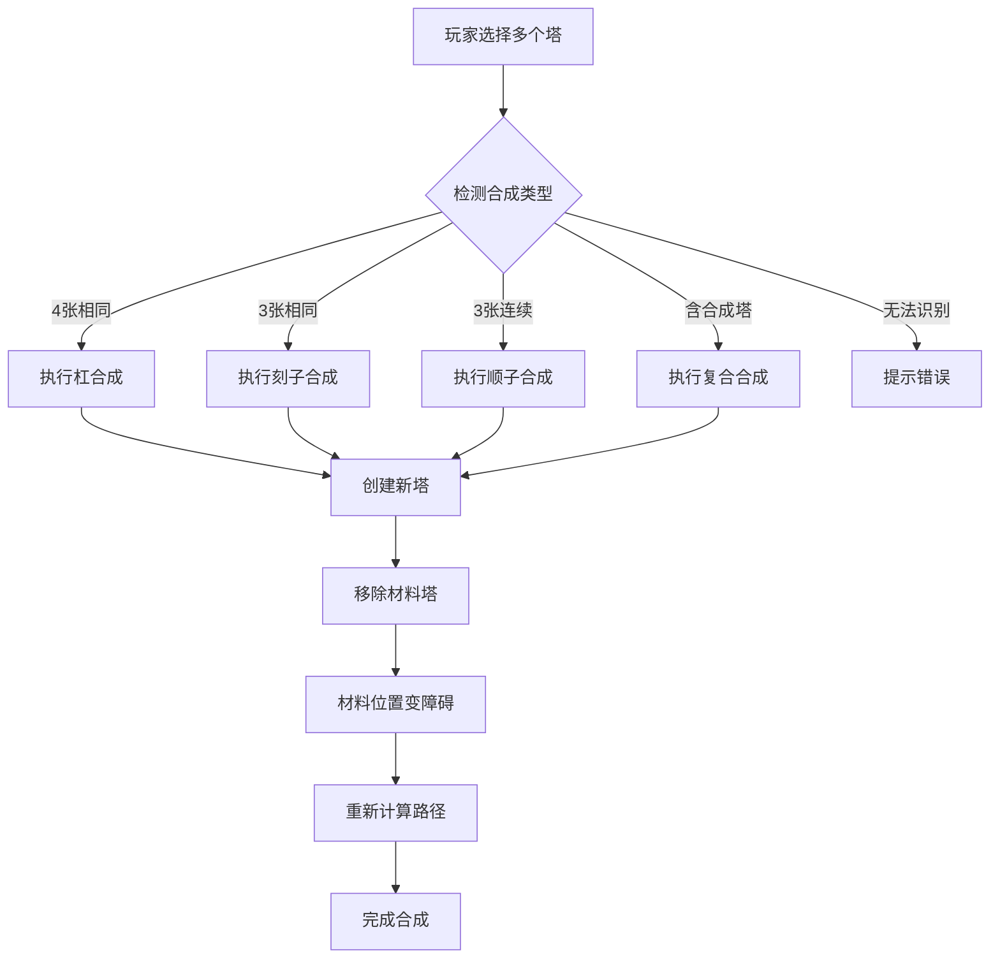
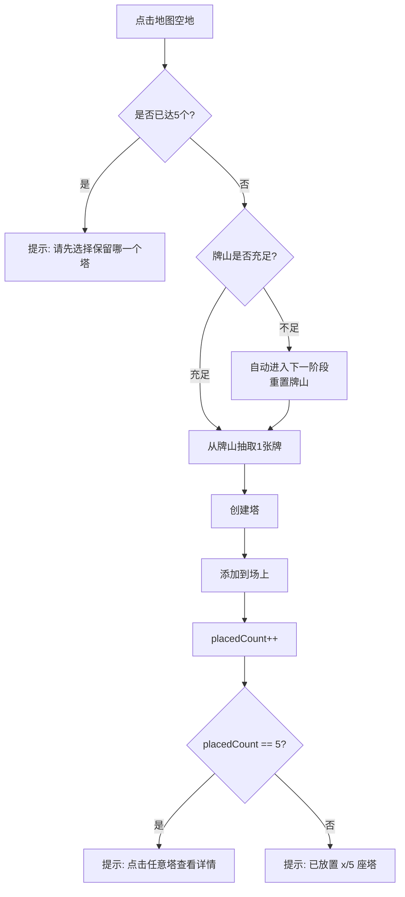
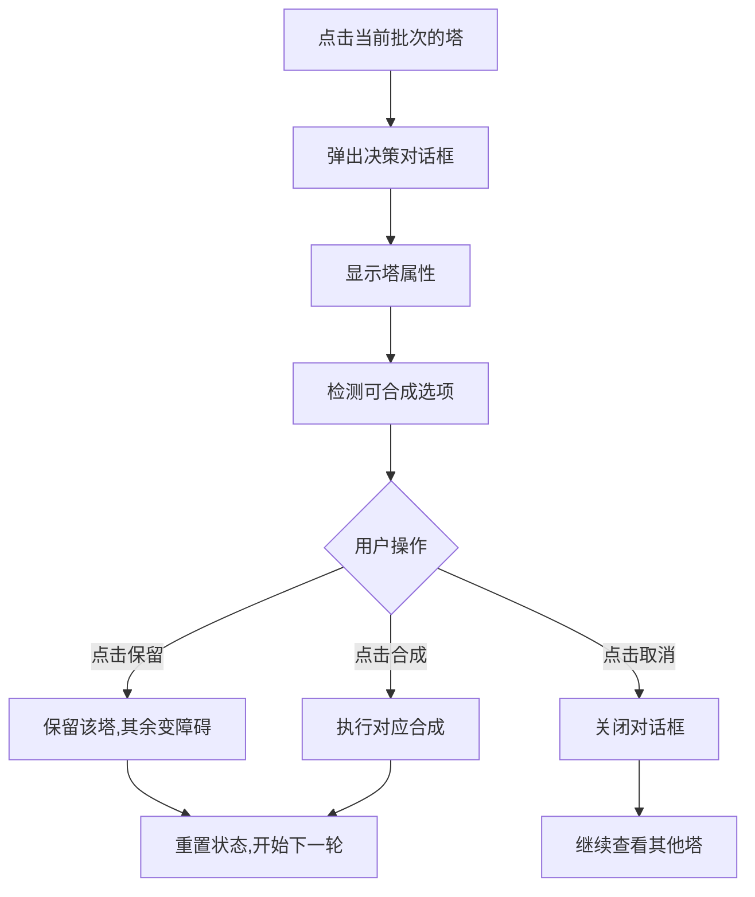

# 麻将塔防 (Mahjong TD) - 技术规格文档

**版本**: v0.3  
**最后更新**: 2026-07-16  
**状态**: Draft (待审核)  
**维护者**: AI Assistant

---

## 1. 项目概述

### 1.1 游戏简介

- **名称**: 麻将塔防 (Mahjong TD)
- **类型**: 策略塔防 + 麻将合成
- **技术栈**: React 18 + TypeScript + Vite + Canvas 2D
- **核心特色**: 
  - 基于麻将牌的合成系统(刻子/顺子/杠)
  - 牌山管理系统(108张数牌)
  - 复合合成机制(超级塔)
  - Debuff系统(灼烧/毒素/减甲)

### 1.2 设计理念

- **简化资源管理**: 每波固定5个木材,无金币升级系统
- **强调策略合成**: 通过麻将组合获得强力塔
- **跨波次保留**: 塔可以保留到下一波,形成持续防御
- **障碍物机制**: 未选择的塔变为障碍物,可手动消除

### 1.3 项目结构

```
src/
├── components/          # UI组件
│   ├── GameCanvas.tsx       # Canvas渲染组件
│   ├── GameUI.tsx           # 游戏UI界面
│   └── TowerDefenseGame.tsx # 主游戏容器
├── config/              # 配置文件
│   ├── towers.ts        # 塔配置和合成规则
│   ├── enemies.ts       # 敌人配置
│   ├── waves.ts         # 波次配置
│   └── map.ts           # 地图配置
├── hooks/               # React Hooks
│   ├── useGameEngine.ts     # 游戏引擎核心
│   ├── useGameLoop.ts       # 游戏循环
│   └── usePathfinding.ts    # BFS寻路
├── types/               # TypeScript类型定义
│   └── game.ts          # 游戏核心类型
├── utils/               # 工具函数
│   ├── MahjongDeck.ts   # 牌山管理类
│   ├── audio.ts         # 音效管理
│   └── pathfinding.ts   # 寻路算法
└── main.tsx             # 应用入口
```

---

## 2. 核心系统设计

### 2.1 牌山系统 (MahjongDeck)

**文件位置**: `src/utils/MahjongDeck.ts`

#### 牌库构成

- **总数**: 108张数牌
- **万子**: 36张 (1-9各4张)
- **条子**: 36张 (1-9各4张)
- **筒子**: 36张 (1-9各4张)
- **不含**: 字牌(东南西北中发白),花牌(梅兰竹菊)

#### 核心API

```typescript
class MahjongDeck {
  constructor()
  
  /**
   * 从牌山顶部抽取指定数量的牌
   * @param count - 要抽取的牌数
   * @returns 抽取的牌数组
   */
  draw(count: number): MahjongTile[]
  
  /**
   * 将指定的牌归还到牌山并重新洗牌
   * @param tiles - 要归还的牌数组
   */
  returnToDeck(tiles: MahjongTile[]): void
  
  /**
   * 获取牌山剩余牌数
   */
  remaining(): number
  
  /**
   * 检查是否需要补充牌山(剩余<5张时)
   */
  needsRefill(): boolean
  
  /**
   * 补充牌山:重置阶段+1,重新初始化108张牌
   */
  refill(): void
  
  /**
   * 获取当前阶段
   */
  getPhase(): number
}
```

#### 洗牌机制

- **算法**: Fisher-Yates洗牌
- **触发条件**: 当`needsRefill()`返回true时(剩余<5张)
- **效果**: 清空已使用区,重新初始化108张牌,阶段+1

#### 还牌机制

- **触发场景**: 
  - 变障碍的塔,其牌返回弃牌堆
  - 合成时消耗的材料牌
- **实现**: `returnToDeck()`方法直接将牌push回deck并重新洗牌

---

### 2.2 塔系统

**文件位置**: `src/config/towers.ts`, `src/types/game.ts`

#### 基础牌属性

所有塔统一攻速 = 1.0 (每秒攻击1次)  
冷却时间计算公式: `cooldown = 1000 / attackSpeed` (ms)

##### 万子门派 (物理爆发·单体)

| 点数 | 伤害 | 范围 | 暴击率 | 特性 |
|------|------|------|--------|------|
| 1    | 6    | 100  | 10%    | 低伤低暴 |
| 2    | 7    | 105  | 12%    | - |
| 3    | 8    | 110  | 14%    | - |
| 4    | 9    | 115  | 16%    | - |
| 5    | 10   | 120  | 18%    | 中等 |
| 6    | 11   | 125  | 20%    | - |
| 7    | 12   | 130  | 22%    | - |
| 8    | 14   | 135  | 25%    | 高伤 |
| 9    | 16   | 140  | 28%    | 最高暴击 |

**特性**: 高伤害,高暴击,单体攻击,物理伤害

##### 条子门派 (连射·穿透·毒素)

| 点数 | 伤害 | 范围 | 穿透 | 毒素/s | 特性 |
|------|------|------|------|--------|------|
| 1    | 5    | 110  | 1    | 1      | 低穿低毒 |
| 2    | 5    | 115  | 1    | 2      | - |
| 3    | 6    | 120  | 2    | 2      | - |
| 4    | 6    | 125  | 2    | 3      | - |
| 5    | 7    | 130  | 2    | 3      | 中等 |
| 6    | 7    | 135  | 3    | 4      | - |
| 7    | 8    | 140  | 3    | 4      | - |
| 8    | 8    | 145  | 3    | 5      | 高穿 |
| 9    | 9    | 150  | 4    | 5      | 最高穿透 |

**特性**: 多目标,穿透,持续毒素伤害,魔法伤害

##### 筒子门派 (范围·减速·眩晕)

| 点数 | 伤害 | 范围 | 溅射半径 | 减速 | 眩晕 | 特性 |
|------|------|------|----------|------|------|------|
| 1    | 4    | 90   | 25       | 20%  | -    | 低溅低缓 |
| 2    | 4    | 95   | 28       | 25%  | -    | - |
| 3    | 5    | 100  | 30       | 30%  | -    | - |
| 4    | 5    | 105  | 33       | 35%  | -    | - |
| 5    | 6    | 110  | 35       | 40%  | -    | 中等 |
| 6    | 6    | 115  | 38       | 45%  | -    | - |
| 7    | 7    | 120  | 40       | 50%  | -    | - |
| 8    | 7    | 125  | 43       | 55%  | -    | 高缓 |
| 9    | 8    | 130  | 45       | 60%  | 10%  | 唯一眩晕 |

**特性**: AOE伤害,减速控制,概率眩晕,魔法伤害

#### 合成后的高级塔

##### 刻子 (3张相同)

**合成规则**:
- 输入: 3张同花色同点数的基础塔
- 输出: 强化塔(伤害×2.5, 暴击率+20%, 暴击倍率+0.5)

**实现代码**:
```typescript
// src/hooks/useGameEngine.ts:605-621
function synthesizeKezi(selectedTowers: Tower[], grid: GridCell[][], towers: Tower[]): Tower {
  const tile = selectedTowers[0].tile
  const baseStats = getTowerStats(tile)
  
  const upgradedTower: Tower = {
    ...selectedTowers[0],
    damage: Math.floor(baseStats.damage! * 2.5),
    critChance: (baseStats.critChance || 0) + 0.2,
    critMultiplier: (baseStats.critMultiplier || 2.0) + 0.5
  }
  
  completeSynthesis(selectedTowers, upgradedTower, grid, towers)
  return upgradedTower
}
```

##### 顺子 (连续3张同花色)

**合成规则**:
- 输入: 3张同花色连续点数的基础塔(如万1+万2+万3)
- 输出: 顺子塔(伤害×1.5, 范围×1.3, 攻速×1.3, 链式攻击)

**链式攻击特性**:
```typescript
chainAttack: {
  enabled: true,
  maxJumps: 3,        // 最多跳跃3次
  jumpRange: 50,      // 跳跃范围50像素
  damageDecay: 0.8    // 每次伤害衰减20%
}
```

**实现代码**:
```typescript
// src/hooks/useGameEngine.ts:624-650
function synthesizeShunzi(selectedTowers: Tower[], grid: GridCell[][], towers: Tower[]): Tower {
  const tile = selectedTowers[0].tile
  const baseStats = getTowerStats(tile)
  
  const shunziTower: Tower = {
    ...selectedTowers[0],
    damage: Math.floor(baseStats.damage! * 1.5),
    range: Math.floor(baseStats.range! * 1.3),
    attackSpeed: baseStats.attackSpeed! * 1.3,
    damageType: 'magic',
    
    chainAttack: {
      enabled: true,
      maxJumps: 3,
      jumpRange: 50,
      damageDecay: 0.8
    }
  }
  
  completeSynthesis(selectedTowers, shunziTower, grid, towers)
  return shunziTower
}
```

##### 杠 (4张相同)

根据花色不同,杠会转化为不同的特殊塔:

###### 万杠 → 红中 (溅射+灼烧)

**属性**:
- 伤害×2.5
- 溅射半径: 60像素
- 灼烧: 10点/秒,持续3秒

**实现**:
```typescript
// src/hooks/useGameEngine.ts:663-678
if (suit === 'wan') {
  gangTower = {
    ...selectedTowers[0],
    tile: { suit: 'hongzhong' as any },
    damage: Math.floor(baseStats.damage! * 2.5),
    splashRadius: 60,
    burnEffect: {
      damagePerSecond: 10,
      duration: 3
    }
  }
}
```

###### 条杠 → 发财 (毒素+扩散)

**属性**:
- 伤害×2.0
- 穿透: 无限(999)
- 毒素: 主目标伤害的30%/秒,持续5秒,最多叠加3层
- 死亡扩散: 范围40像素

**实现**:
```typescript
// src/hooks/useGameEngine.ts:680-700
else if (suit === 'tiao') {
  gangTower = {
    ...selectedTowers[0],
    tile: { suit: 'facai' as any },
    damage: Math.floor(baseStats.damage! * 2.0),
    pierce: 999,
    poisonEffect: {
      damagePercent: 0.3,
      duration: 5,
      maxStacks: 3,
      spreadOnDeath: {
        enabled: true,
        range: 40
      }
    }
  }
}
```

###### 筒杠 → 白板 (减甲)

**属性**:
- 伤害×2.2
- 减甲: 降低50%护甲,持续4秒
- 全队共享: 被减甲的敌人受到所有塔的伤害增加

**实现**:
```typescript
// src/hooks/useGameEngine.ts:702-717
else if (suit === 'tong') {
  gangTower = {
    ...selectedTowers[0],
    tile: { suit: 'baiban' as any },
    damage: Math.floor(baseStats.damage! * 2.2),
    armorReduction: {
      percent: 0.5,
      duration: 4,
      globalDebuff: true  // 全队共享
    }
  }
}
```

##### 复合合成 (超级塔)

**合成规则**: 合成塔 + 任意基础塔 = 超级塔

###### 超级刻子 (刻子 + 任意塔)

- 伤害×1.5 (在刻子基础上再乘)
- 范围×1.2
- 暴击率×1.3

###### 超级顺子 (顺子 + 任意塔)

- 伤害×1.3
- 链式攻击增强: 跳跃次数+1, 伤害衰减减少5%

###### 超级红中 (红中 + 任意塔)

- 伤害×1.4
- 溅射半径×1.3
- 灼烧伤害×1.5, 持续时间+1秒

###### 超级发财 (发财 + 任意塔)

- 伤害×1.4
- 毒素伤害百分比×1.3
- 持续时间+2秒, 最大层数+1

###### 超级白板 (白板 + 任意塔)

- 伤害×1.4
- 减甲百分比+15% (上限80%)
- 持续时间+2秒

**实现代码**:
```typescript
// src/hooks/useGameEngine.ts:525-602
const performCompoundSynthesis = useCallback((towers: Tower[]): Tower => {
  const baseTower = towers[0]
  
  if (baseTower.tile.suit === 'kezi') {
    return {
      ...baseTower,
      tile: { suit: 'super_kezi' as any },
      damage: Math.floor(baseTower.damage * 1.5),
      range: Math.floor(baseTower.range * 1.2),
      critChance: baseTower.critChance ? baseTower.critChance * 1.3 : 0.25
    }
  }
  
  // ... 其他超级塔逻辑
}, [])
```

---

### 2.3 合成系统

**文件位置**: `src/hooks/useGameEngine.ts`

#### 合成优先级

1. **最高**: 杠 → 中发白 (强力单塔)
2. **次高**: 刻子 → 强化塔 (中等强度)
3. **中等**: 顺子 → 链式塔 (战术价值)
4. **最低**: 复合合成 (需要已有合成塔)

#### 检测函数

```typescript
// 检测刻子(3张相同)
function isKezi(tiles: MahjongTile[]): boolean {
  if (tiles.length !== 3) return false
  const first = tiles[0]
  if (!first.suit || !first.number) return false
  return tiles.every(t => t.suit === first.suit && t.number === first.number)
}

// 检测顺子(连续3张)
function isShunzi(tiles: MahjongTile[]): boolean {
  if (tiles.length !== 3) return false
  const numbers = tiles.map(t => t.number).filter(Boolean).sort((a, b) => a! - b!)
  if (numbers.length !== 3) return false
  const suit = tiles[0].suit
  if (!suit) return false
  return tiles.every(t => t.suit === suit) && 
         numbers[1] === numbers[0]! + 1 && 
         numbers[2] === numbers[1]! + 1
}

// 检测杠(4张相同)
function isGang(tiles: MahjongTile[]): boolean {
  if (tiles.length !== 4) return false
  const first = tiles[0]
  if (!first.suit || !first.number) return false
  return tiles.every(t => t.suit === first.suit && t.number === first.number)
}
```

#### 合成流程



---

### 2.4 Debuff系统

**文件位置**: `src/types/game.ts`, `src/hooks/useGameEngine.ts`

#### Debuff类型定义

```typescript
interface Enemy {
  debuffs?: Array<{
    type: 'armor_reduction' | 'burn' | 'poison'
    value: number         // 效果值
    duration: number      // 剩余持续时间(秒)
    stacks?: number       // 叠加层数(用于毒素)
    source?: string       // 来源塔ID(用于globalDebuff追踪)
  }>
}
```

#### 灼烧 (Burn)

**来源**: 红中(万杠)  
**效果**: 每秒造成固定伤害  
**持续时间**: 3秒  
**可叠加**: 否(刷新持续时间)

**处理逻辑**:
```typescript
// src/hooks/useGameEngine.ts:957-965
if (debuff.type === 'burn') {
  const burnDamage = debuff.value * (deltaTime / 1000)
  enemy.health -= burnDamage
  
  if (enemy.health <= 0 && !enemy.isDead) {
    enemy.isDead = true
    setUiState(prev => ({ ...prev, gold: prev.gold + enemy.reward }))
  }
}
```

#### 毒素 (Poison)

**来源**: 发财(条杠)  
**效果**: 按最大血量百分比造成伤害  
**持续时间**: 5秒  
**可叠加**: 是,最多3层  
**死亡扩散**: 是,范围40像素(TODO: 尚未实现扩散逻辑)

**处理逻辑**:
```typescript
// src/hooks/useGameEngine.ts:966-974
else if (debuff.type === 'poison') {
  const poisonDamage = enemy.maxHealth * debuff.value * (deltaTime / 1000)
  enemy.health -= poisonDamage
  
  if (enemy.health <= 0 && !enemy.isDead) {
    enemy.isDead = true
    setUiState(prev => ({ ...prev, gold: prev.gold + enemy.reward }))
  }
}
```

#### 减甲 (Armor Reduction)

**来源**: 白板(筒杠)  
**效果**: 降低目标护甲百分比  
**持续时间**: 4秒  
**全队共享**: 是(白板特性,通过`globalDebuff`标志)

**处理逻辑**:
```typescript
// src/hooks/useGameEngine.ts:1344-1353
const dealDamage = useCallback((enemy: Enemy, damage: number, sourceTower?: Tower) => {
  let finalDamage = damage
  
  // 检查是否有减甲debuff
  if (enemy.debuffs) {
    const armorReduction = enemy.debuffs.find(d => d.type === 'armor_reduction')
    if (armorReduction) {
      finalDamage *= (1 + armorReduction.value)  // 增加伤害
    }
  }
  
  enemy.health -= finalDamage
}, [])
```

**全局Debuff应用**:
```typescript
// src/hooks/useGameEngine.ts:1247-1268
if (tower.armorReduction?.globalDebuff) {
  gameStateRef.current.enemies.forEach(otherEnemy => {
    if (otherEnemy.id === target.id) return
    
    if (!otherEnemy.debuffs) otherEnemy.debuffs = []
    
    const existing = otherEnemy.debuffs?.find(d => 
      d.type === 'armor_reduction' && d.source === tower.id
    )
    
    if (existing) {
      existing.duration = tower.armorReduction!.duration
    } else {
      otherEnemy.debuffs!.push({
        type: 'armor_reduction',
        value: tower.armorReduction!.percent,
        duration: tower.armorReduction!.duration,
        source: tower.id
      })
    }
  })
}
```

---

### 2.5 敌人系统

**文件位置**: `src/config/enemies.ts`, `src/types/game.ts`

#### 敌人类型

##### 普通敌人 (Basic)

- HP: 8 (最低攻击力4 × 2)
- 速度: 60 px/s
- 护甲: 0
- 魔抗: 0
- 奖励: 5金币
- 颜色: #FF6B6B (红色)
- 半径: 12px

##### 快速敌人 (Fast)

- HP: 6
- 速度: 100 px/s
- 护甲: 0
- 魔抗: 0
- 奖励: 7金币
- 颜色: #FFA500 (橙色)
- 半径: 10px

##### 坦克敌人 (Tank)

- HP: 20
- 速度: 40 px/s
- 护甲: 5
- 魔抗: 20%
- 奖励: 15金币
- 颜色: #8B0000 (深红)
- 半径: 14px

#### 波次递增机制

血量倍率随波次递增:

| 阶段 | 波次 | 倍率范围 | 说明 |
|------|------|----------|------|
| 第1阶段 | 1-3 | 1.0x - 1.5x | 新手教学 |
| 第2阶段 | 4-6 | 1.8x - 2.7x | 逐渐加强 |
| 第3阶段 | 7-9 | 3.3x - 4.8x | 中期挑战 |
| 第4阶段 | 10-12 | 5.8x - 8.5x | 后期困难 |

**计算公式**:
```typescript
actualHealth = baseHealth * healthMultiplier
```

**配置示例** (`src/config/waves.ts`):
```typescript
{ 
  waveNumber: 1, 
  enemies: [{ type: 'basic', count: 5, interval: 2000 }],
  healthMultiplier: 1.0
},
{ 
  waveNumber: 12, 
  enemies: [
    { type: 'basic', count: 25, interval: 600 },
    { type: 'fast', count: 20, interval: 500 },
    { type: 'tank', count: 12, interval: 1200 }
  ],
  isBossWave: true,
  healthMultiplier: 8.5
}
```

---

## 3. 交互流程

### 3.1 放置流程



**详细步骤**:
1. 用户点击地图空地
2. 检查`placedCount < 5`
3. 检查牌山是否需要补充(`mahjongDeck.needsRefill()`)
4. 从牌山抽取1张牌(`mahjongDeck.draw(1)`)
5. 根据牌创建塔(`getTowerStats(tile)`)
6. 将塔添加到`gameStateRef.current.towers`
7. 将塔ID添加到`currentBatchTowerIds`
8. `placedCount++`
9. 扣除1木材
10. 更新UI(`deckRemaining`, `placedCount`)
11. 如果`placedCount === 5`,提示用户点击塔查看详情

**实现代码**:
```typescript
// src/hooks/useGameEngine.ts:139-250
const placeTower = useCallback((gridPos: { row: number; col: number }) => {
  if (!uiState.canPlaceTowers) return null
  if (gameStateRef.current.placedCount >= 5) {
    alert('请先选择保留哪一个塔!')
    return null
  }
  
  const { grid, mahjongDeck } = gameStateRef.current
  
  if (mahjongDeck.needsRefill()) {
    alert('敌人进化进入阶段二!\n获得新牌山,敌人数值增强!')
    mahjongDeck.refill()
  }
  
  const drawnTiles = mahjongDeck.draw(1)
  const tile = drawnTiles[0]
  
  const newTower: Tower = {
    id: `tower_${Date.now()}`,
    tile: tile,
    position: gridToPixel(gridPos.row, gridPos.col),
    gridPosition: gridPos,
    damage: stats.damage || 10,
    // ... 其他属性
  }
  
  gameStateRef.current.towers.push(newTower)
  gameStateRef.current.currentBatchTowerIds.push(newTower.id)
  gameStateRef.current.placedCount++
  
  setUiState(prev => ({
    ...prev,
    wood: prev.wood - 1,
    deckRemaining: mahjongDeck.remaining(),
    placedCount: gameStateRef.current.placedCount
  }))
}, [uiState.wood])
```

### 3.2 决策流程



**详细步骤**:
1. 用户点击当前批次的塔(`handleTowerClick(towerId)`)
2. 验证塔是否在`currentBatchTowerIds`中
3. 设置`selectedTowerId`和`needsDecision = true`
4. 弹出决策对话框(`SynthesisDialog`组件)
5. 显示塔的详细信息(牌面/属性)
6. 用户选择操作:
   - 保留: 该塔留在场上,其余变障碍
   - 合成: 执行对应合成(刻子/顺子/杠),其余变障碍
   - 取消: 关闭对话框,继续查看
7. 重置`placedCount = 0`,清空`currentBatchTowerIds`
8. 允许下一轮放置

**实现代码**:
```typescript
// src/hooks/useGameEngine.ts:274-297
const handleTowerClick = useCallback((towerId: string) => {
  const { towers, currentBatchTowerIds } = gameStateRef.current
  
  if (!currentBatchTowerIds.includes(towerId)) {
    console.log('这不是当前批次的塔,无法操作')
    return
  }
  
  const tower = towers.find(t => t.id === towerId)
  if (!tower) return
  
  setUiState(prev => ({
    ...prev,
    selectedTowerId: towerId,
    needsDecision: true
  }))
}, [])

// src/hooks/useGameEngine.ts:308-362
const finalizeTowers = useCallback((keepTowerId: string) => {
  const { towers, grid, currentBatchTowerIds, mahjongDeck } = gameStateRef.current
  
  currentBatchTowerIds.forEach(towerId => {
    const tower = towers.find(t => t.id === towerId)
    if (!tower) return
    
    if (towerId === keepTowerId) {
      console.log(`✅ 保留: ${formatTileName(tower.tile)} (留在场上继续攻击)`)
    } else {
      mahjongDeck.returnToDeck([tower.tile])
      
      const { row, col } = tower.gridPosition
      grid[row][col].type = 'obstacle'
      
      const index = towers.findIndex(t => t.id === towerId)
      if (index !== -1) {
        towers.splice(index, 1)
      }
      
      console.log(`🔄 变障碍: ${formatTileName(tower.tile)} (牌已返回牌山)`)
    }
  })
  
  gameStateRef.current.currentBatchTowerIds = []
  gameStateRef.current.placedCount = 0
  
  setUiState(prev => ({
    ...prev,
    deckRemaining: mahjongDeck.remaining(),
    placedCount: 0,
    canPlaceTowers: true,
    needsDecision: false,
    selectedTowerId: null
  }))
}, [])
```

### 3.3 障碍物管理流程

**功能**: 玩家可以点击障碍物格子,将其消除为空地

**实现位置**: TODO (尚未实现)

**预期流程**:
1. 用户点击障碍物格子
2. 弹出确认对话框:"是否消除此障碍物?"
3. 用户选择:
   - 是: 
     - 将格子类型改为`'empty'`
     - 调用`calculatePath()`重新计算路径
     - 更新所有敌人的路径
   - 否: 关闭对话框,不做任何操作

---

## 4. UI设计

### 4.1 顶部信息栏

**组件**: `GameUI.tsx`

**布局**:
```
┌─────────────────────────────────────────┐
│ 🀄 牌山: 85  │ 阶段: 前期  │ 放置: 3/5  │
│ 💰 金币: 50  │ 波次: 1/12  │ 生命: 15/15│
└─────────────────────────────────────────┘
```

**元素**:
- 牌山图标 + 剩余数量
- 当前阶段(前期/中期/后期)
- 已放置进度(x/5)
- 金币数量
- 当前波次/总波次
- 矿坑生命值

### 4.2 决策对话框

**组件**: `SynthesisDialog.tsx`

**布局**:
```
┌─────────────────────────────────────┐
│      选择要留在场上的塔              │
─────────────────────────────────────┤
│           🀅 (伍万)                  │
│                                     │
│   攻击力: 12    攻速: 1.0/s         │
│   范围: 120     伤害类型: physical  │
│   暴击率: 18%                       │
├─────────────────────────────────────┤
│  [✓ 留在场上]  [取消]               │
│                                     │
│  提示: 选择保留后,其余4个塔将变成障碍│
─────────────────────────────────────┘
```

**关键元素**:
- 标题: "选择要留在场上的塔"
- Unicode麻将牌面预览(28px)
- 属性网格(2列布局)
- 保留按钮(绿色)
- 取消按钮(橙色)
- 底部提示文字

### 4.3 Canvas渲染

**组件**: `GameCanvas.tsx`

**绘制顺序**:
1. 清空画布
2. 绘制网格(地形)
3. 绘制必经点标记
4. 绘制敌人
5. 绘制塔(麻将牌样式)
6. 绘制子弹

**塔绘制细节**:
```typescript
// src/hooks/useGameEngine.ts:1802-1860
const drawTower = (ctx: CanvasRenderingContext2D, tower: Tower) => {
  const TOWER_WIDTH = 36
  const TOWER_HEIGHT = 40
  
  // 绘制麻将牌底座(白色背景)
  ctx.fillStyle = '#FAFAFA'
  ctx.fillRect(
    tower.position.x - TOWER_WIDTH / 2,
    tower.position.y - TOWER_HEIGHT / 2,
    TOWER_WIDTH,
    TOWER_HEIGHT
  )
  
  // 边框
  ctx.strokeStyle = '#333'
  ctx.lineWidth = 2
  ctx.strokeRect(...)
  
  // 根据花色设置颜色
  let color: string
  if (tower.tile.suit) {
    const suitColors: Record<string, string> = { 
      wan: '#E53935',   // 万子红色
      tiao: '#43A047',  // 条子绿色
      tong: '#1E88E5'   // 筒子蓝色
    }
    color = suitColors[tower.tile.suit] || '#333'
  }
  
  // 绘制Unicode麻将字符
  const unicodeChar = getTileUnicode(tower.tile)
  ctx.font = '28px "Segoe UI Emoji", "Apple Color Emoji", Arial'
  ctx.textAlign = 'center'
  ctx.textBaseline = 'middle'
  ctx.fillStyle = color
  ctx.fillText(unicodeChar, tower.position.x, tower.position.y)
  
  // 绘制属性文字
  ctx.font = 'bold 9px Arial'
  ctx.fillStyle = '#666'
  ctx.fillText(`${tower.damage}`, tower.position.x, tower.position.y + 16)
}
```

**必经点绘制**:
```typescript
// src/hooks/useGameEngine.ts:1672-1735
const drawWaypoints = (ctx: CanvasRenderingContext2D) => {
  WAYPOINTS.forEach((waypoint, index) => {
    const x = waypoint.col * cellSize + cellSize / 2
    const y = waypoint.row * cellSize + cellSize / 2
    
    let color: string
    let radius: number
    
    if (index === 0) {
      color = '#90EE90'  // 起点 - 绿色大圆
      radius = 12
    } else if (index === WAYPOINTS.length - 1) {
      color = '#FF6B6B'  // 终点 - 红色大圆
      radius = 12
    } else if (waypoint.label === '矿坑') {
      color = '#FFD700'  // 矿坑 - 黄色中圆
      radius = 10
    } else {
      color = '#4169E1'  // 转折点 - 蓝色小圆
      radius = 8
    }
    
    ctx.fillStyle = color
    ctx.globalAlpha = 0.7
    ctx.beginPath()
    ctx.arc(x, y, radius, 0, Math.PI * 2)
    ctx.fill()
    
    // 绘制标签文字(索引数字)
    ctx.fillStyle = '#000000'
    ctx.font = 'bold 10px Arial'
    ctx.textAlign = 'center'
    ctx.textBaseline = 'middle'
    ctx.fillText(`${index}`, x, y)
  })
}
```

---

## 5. 技术实现要点

### 5.1 类型定义

**文件位置**: `src/types/game.ts`

#### 麻将相关类型

```typescript
export type MahjongSuit = 'wan' | 'tiao' | 'tong'
export type MahjongNumber = 1 | 2 | 3 | 4 | 5 | 6 | 7 | 8 | 9
export type DragonTile = 'zhong' | 'fa' | 'bai'
export type WindTile = 'dong' | 'nan' | 'xi' | 'bei'
export type FlowerTile = 'mei' | 'lan' | 'zhu' | 'ju'
export type FiveElements = 'jin' | 'mu' | 'shui' | 'huo' | 'tu'

export interface MahjongTile {
  suit?: MahjongSuit | 'kezi' | 'shunzi' | 'gang' | 'hongzhong' | 'facai' | 'baiban' | 'super_kezi' | 'super_shunzi' | 'super_hongzhong' | 'super_facai' | 'super_baiban'
  number?: MahjongNumber
  dragon?: DragonTile
  wind?: WindTile
  flower?: FlowerTile
  element?: FiveElements
}
```

#### 塔类型

```typescript
export interface Tower {
  id: string
  tile: MahjongTile
  gridPosition: { row: number; col: number }
  position: Position
  damage: number
  range: number
  attackSpeed: number
  lastAttackTime: number
  damageType: 'physical' | 'magic' | 'pure'
  
  // 链式攻击(顺子特性)
  chainAttack?: {
    enabled: boolean
    maxJumps: number
    jumpRange: number
    damageDecay: number
  }
  
  // 灼烧效果(红中特性)
  burnEffect?: {
    damagePerSecond: number
    duration: number
  }
  
  // 毒素增强(发财特性)
  poisonEffect?: {
    damagePercent: number
    duration: number
    maxStacks: number
    spreadOnDeath?: {
      enabled: boolean
      range: number
    }
  }
  
  // 减甲效果(白板特性)
  armorReduction?: {
    percent: number
    duration: number
    globalDebuff: boolean
  }
  
  // 特效属性
  multiTarget?: boolean
  splashRadius?: number
  slowEffect?: number
  critChance?: number
  critMultiplier?: number
  poisonDamage?: number
  poisonDuration?: number
  stunChance?: number
  stunDuration?: number
  pierce?: number
  targetId?: string
}
```

#### 敌人类型

```typescript
export interface Enemy {
  id: string
  type: 'basic' | 'fast' | 'tank'
  position: Position
  health: number
  maxHealth: number
  speed: number
  armor: number
  magicResist: number
  pathIndex: number
  progress: number
  reward: number
  reachedEnd?: boolean
  slowTimer?: number
  isDead?: boolean
  
  // Debuff列表
  debuffs?: Array<{
    type: 'armor_reduction' | 'burn' | 'poison'
    value: number
    duration: number
    stacks?: number
    source?: string
  }>
  
  // 特效相关属性
  poisonEffects?: Array<{
    damage: number
    duration: number
    startTime: number
  }>
  isStunned?: boolean
  stunEndTime?: number
}
```

### 5.2 关键函数签名

**文件位置**: `src/hooks/useGameEngine.ts`

```typescript
// 放置塔
const placeTower = useCallback((gridPos: { row: number; col: number }): Tower[] | null => { ... })

// 点击塔
const handleTowerClick = useCallback((towerId: string): void => { ... })

// 完成决策
const finalizeTowers = useCallback((keepTowerId: string): void => { ... })

// 合成塔
const synthesizeTowers = useCallback((selectedIds: string[]): Tower | null => { ... })

// 刻子合成
const synthesizeKezi = (selectedTowers: Tower[], grid: GridCell[][], towers: Tower[]): Tower => { ... }

// 顺子合成
const synthesizeShunzi = (selectedTowers: Tower[], grid: GridCell[][], towers: Tower[]): Tower => { ... }

// 杠合成
const synthesizeGang = (selectedTowers: Tower[], grid: GridCell[][], towers: Tower[]): Tower => { ... }

// 复合合成
const performCompoundSynthesis = useCallback((towers: Tower[]): Tower => { ... })

// 造成伤害
const dealDamage = useCallback((enemy: Enemy, damage: number, sourceTower?: Tower): void => { ... })

// 查找最近敌人
const findNearestEnemyFrom = useCallback(
  (fromPos: { x: number; y: number }, range: number, excludeIds: string[]): Enemy | null => { ... }
)

// 计算路径
const calculatePath = (grid: GridCell[][]): { row: number; col: number }[] => { ... }
```

### 5.3 游戏循环

**文件位置**: `src/hooks/useGameLoop.ts`

```typescript
export function useGameLoop(
  update: (deltaTime: number) => void,
  render: () => void,
  isActive: boolean
) {
  const requestRef = useRef<number>()
  const previousTimeRef = useRef<number>()
  
  const animate = useCallback((time: number) => {
    if (previousTimeRef.current !== undefined) {
      const deltaTime = time - previousTimeRef.current
      
      if (isActive) {
        update(deltaTime)
        render()
      }
    }
    
    previousTimeRef.current = time
    requestRef.current = requestAnimationFrame(animate)
  }, [update, render, isActive])
  
  const start = useCallback(() => {
    requestRef.current = requestAnimationFrame(animate)
  }, [animate])
  
  const stop = useCallback(() => {
    if (requestRef.current) {
      cancelAnimationFrame(requestRef.current)
    }
  }, [])
  
  useEffect(() => {
    if (isActive) {
      start()
    } else {
      stop()
    }
    
    return () => stop()
  }, [isActive, start, stop])
  
  return { start, stop, pause: stop, resume: start }
}
```

### 5.4 寻路算法

**文件位置**: `src/hooks/usePathfinding.ts`

**算法**: BFS (广度优先搜索)

**核心逻辑**:
```typescript
export function usePathfinding() {
  const calculatePath = useCallback((grid: GridCell[][]): { row: number; col: number }[] => {
    const rows = grid.length
    const cols = grid[0].length
    
    // 找到起点和终点
    let startPos: { row: number; col: number } | null = null
    let endPos: { row: number; col: number } | null = null
    
    for (let r = 0; r < rows; r++) {
      for (let c = 0; c < cols; c++) {
        if (grid[r][c].type === 'start') startPos = { row: r, col: c }
        if (grid[r][c].type === 'end') endPos = { row: r, col: c }
      }
    }
    
    if (!startPos || !endPos) return []
    
    // BFS寻路
    const queue: Array<{ row: number; col: number; path: { row: number; col: number }[] }> = [
      { row: startPos.row, col: startPos.col, path: [startPos] }
    ]
    
    const visited = new Set<string>()
    visited.add(`${startPos.row},${startPos.col}`)
    
    while (queue.length > 0) {
      const current = queue.shift()!
      
      if (current.row === endPos.row && current.col === endPos.col) {
        return current.path
      }
      
      // 探索四个方向
      const directions = [
        { dr: -1, dc: 0 },  // 上
        { dr: 1, dc: 0 },   // 下
        { dr: 0, dc: -1 },  // 左
        { dr: 0, dc: 1 }    // 右
      ]
      
      for (const dir of directions) {
        const newRow = current.row + dir.dr
        const newCol = current.col + dir.dc
        
        if (
          newRow >= 0 && newRow < rows &&
          newCol >= 0 && newCol < cols &&
          grid[newRow][newCol].type !== 'tower' &&
          grid[newRow][newCol].type !== 'obstacle' &&
          !visited.has(`${newRow},${newCol}`)
        ) {
          visited.add(`${newRow},${newCol}`)
          queue.push({
            row: newRow,
            col: newCol,
            path: [...current.path, { row: newRow, col: newCol }]
          })
        }
      }
    }
    
    return []  // 无路径
  }, [])
  
  return { calculatePath }
}
```

---

## 6. 配置数据

### 6.1 塔配置

**文件位置**: `src/config/towers.ts`

```typescript
export const BASE_TOWER_STATS: Record<MahjongSuit, Record<MahjongNumber, Partial<BaseTowerConfig>>> = {
  wan: {
    1: { damage: 6, range: 100, attackSpeed: 1.0, damageType: 'physical', critChance: 0.1 },
    2: { damage: 7, range: 105, attackSpeed: 1.0, damageType: 'physical', critChance: 0.12 },
    // ... 3-8
    9: { damage: 16, range: 140, attackSpeed: 1.0, damageType: 'physical', critChance: 0.28 }
  },
  tiao: {
    1: { damage: 5, range: 110, attackSpeed: 1.0, damageType: 'magic', pierce: 1, poisonDamage: 1 },
    // ... 2-8
    9: { damage: 9, range: 150, attackSpeed: 1.0, damageType: 'magic', pierce: 4, poisonDamage: 5 }
  },
  tong: {
    1: { damage: 4, range: 90, attackSpeed: 1.0, damageType: 'magic', splashRadius: 25, slowEffect: 0.2 },
    // ... 2-8
    9: { damage: 8, range: 130, attackSpeed: 1.0, damageType: 'magic', splashRadius: 45, slowEffect: 0.6, stunChance: 0.1 }
  }
}
```

### 6.2 敌人配置

**文件位置**: `src/config/enemies.ts`

```typescript
export const ENEMY_TYPES = {
  basic: {
    health: 8,
    speed: 60,
    armor: 0,
    magicResist: 0,
    reward: 5,
    color: '#FF6B6B',
    radius: 12
  },
  fast: {
    health: 6,
    speed: 100,
    armor: 0,
    magicResist: 0,
    reward: 7,
    color: '#FFA500',
    radius: 10
  },
  tank: {
    health: 20,
    speed: 40,
    armor: 5,
    magicResist: 0.2,
    reward: 15,
    color: '#8B0000',
    radius: 14
  }
}
```

### 6.3 波次配置

**文件位置**: `src/config/waves.ts`

```typescript
export const WAVES: WaveConfig[] = [
  { 
    waveNumber: 1, 
    enemies: [{ type: 'basic', count: 5, interval: 2000 }],
    healthMultiplier: 1.0
  },
  // ... 波次2-11
  { 
    waveNumber: 12, 
    enemies: [
      { type: 'basic', count: 25, interval: 600 },
      { type: 'fast', count: 20, interval: 500 },
      { type: 'tank', count: 12, interval: 1200 }
    ],
    isBossWave: true,
    healthMultiplier: 8.5
  }
]
```

### 6.4 地图配置

**文件位置**: `src/config/map.ts`

```typescript
export const MAP_CONFIG = {
  rows: 15,
  cols: 20,
  cellSize: 40
}

export const WAYPOINTS = [
  { row: 0, col: 0, label: '起点' },
  { row: 0, col: 5, label: '' },
  { row: 5, col: 5, label: '矿坑' },
  { row: 5, col: 15, label: '' },
  { row: 14, col: 15, label: '终点' }
]
```

---

## 7. 未来扩展(预留接口)

### 7.1 胡牌检测系统 (TODO)

**计划功能**:
- 检测时机: 每次放置5个塔并完成决策后
- 基于场上**所有显示的塔**(包括之前回合保留的)
- 胡牌条件: 标准麻将胡牌结构(4面子+1雀头)

**简化版检测**(适合TD场景):
1. **清一色**: 所有塔同花色
2. **对对和**: 4个刻子 + 1对子
3. **断幺九**: 没有1和9点数的牌
4. **混一色**: 一种花色 + 字牌
5. **国士无双**: 13种幺九牌各1张 + 任意1张重复
6. **大三元**: 红中+发财+白板各1组刻子
7. **四暗刻**: 4个暗刻

**番型Buff列表** (计划中):

| 番型 | 番数 | Buff效果 |
|------|------|----------|
| 立直 | 1番 | 全塔攻速+10% |
| 断幺九 | 1番 | 全塔伤害+15% |
| 平和 | 1番 | 全塔范围+10% |
| 一杯口 | 1番 | 暴击率+10% |
| 对对和 | 2番 | 全塔伤害+30% |
| 三色同刻 | 2番 | 穿透+2 |
| 三暗刻 | 2番 | 暴击伤害+50% |
| 混一色 | 3番 | 同花色伤害+50% |
| 纯全带幺九 | 3番 | 1/9点数塔伤害+40% |
| 清一色 | 6番 | 全塔伤害×2, 攻速+30% |
| 国士无双 | 役满 | 全属性×3 |
| 大三元 | 役满 | 中发白威力×4 |
| 四暗刻 | 役满 | 100%暴击 |

**实现思路**:
```typescript
// TODO: 需要在useGameEngine.ts中实现
interface GlobalBuffs {
  activeHuPatterns: HuPattern[]
  passiveBuffs: {
    keziCount: number
    shunziCount: number
  }
}

function detectHuPattern(): HuPattern | null {
  const towers = getAllFieldTowers()
  
  if (towers.length < 14) return null
  
  const tileCount = countTiles(towers)
  
  // 检测清一色
  if (isAllSameSuit(towers)) {
    return { name: '清一色', fan: 6, buff: HU_PATTERNS['清一色'].buff, towers }
  }
  
  // 检测对对和
  const keziCount = countKezi(tileCount)
  const duiZiCount = countDuiZi(tileCount)
  if (keziCount >= 4 && duiZiCount >= 1) {
    return { name: '对对和', fan: 2, buff: HU_PATTERNS['对对和'].buff, towers }
  }
  
  // ... 其他番型检测
  
  return null
}
```

### 7.2 被动增益系统 (TODO)

**计划功能**:
- 触发条件: 场上存在刻子/顺子组合,但玩家**未选择合成**
- 每有一组刻子/顺子,提供一层Buff

**增益效果** (计划中):

**刻子在场被动** (per group):
- 全塔伤害: +5%
- 暴击率: +2%

**顺子在场被动** (per group):
- 全塔攻速: +3%
- 全塔范围: +2%

**叠加规则**:
- 线性叠加
- 最多5层(防止过强)

### 7.3 梅兰竹菊终极塔 (TODO)

**合成条件**(待定):
- 方案A: 四风(东+南+西+北) → 梅花
- 方案B: 三中发白(红中+发财+白板) → 兰花
- 方案C: 特定组合 → 竹子/菊花

**定位**:
- 终极塔: 占据1个格子
- 超强属性: 基础属性×5, 范围×3

**特殊能力** (计划中):
- 梅花: 全屏攻击
- 兰花: 经济增益(奖励×2)
- 竹子: 防御增益(生命值+5)
- 菊花: 控制增益(眩晕概率+50%)

### 7.4 五行具体效果 (TODO)

**金属性 (Metal)**:
- 穿透增强: +2穿透
- 适用: 条子风牌

**木属性 (Wood)**:
- 毒素增强: 毒素伤害+50%,持续时间+2秒
- 适用: 条子风牌

**水属性 (Water)**:
- 减速增强: 减速效果+20%
- 适用: 筒子风牌

**火属性 (Fire)**:
- 溅射增强: 溅射半径+20,溅射伤害+30%
- 适用: 万子风牌

**土属性 (Earth)**:
- 护甲增强: 自身护甲+10
- 适用: 所有风牌

---

## 8. 已知问题与TODO

### 8.1 待实现功能

- [ ] 删除升级系统和游戏等级(当前仍有upgradeGameLevel函数)
- [ ] 删除木材资源(当前仍在使用)
- [ ] 实现障碍物点击消除对话框
- [ ] 实现胡牌检测算法
- [ ] 实现被动增益系统
- [ ] 添加音效(抽牌/合成/攻击/胡牌)
- [ ] 添加粒子特效(合成/攻击/死亡)
- [ ] 平衡性测试和调整

### 8.2 已知Bug

- [ ] 毒素死亡扩散未实现(代码中有spreadOnDeath配置但未实际应用)
- [ ] 部分合成塔类型定义不一致(如'hongzhong'/'facai'/'baiban'在MahjongTile.suit中定义为字符串联合类型)

### 8.3 性能优化

- [ ] Canvas脏矩形优化(当前每帧重绘整个画布)
- [ ] 敌人碰撞检测优化(空间分区)
- [ ] 路径计算缓存(避免重复计算)
- [ ] 减少不必要的重渲染(useMemo/useCallback优化)

---

## 9. 附录

### 9.1 术语表

| 术语 | 英文 | 说明 |
|------|------|------|
| 刻子 | Kezi | 3张同花色同点数的牌 |
| 顺子 | Shunzi | 3张同花色连续点数的牌 |
| 杠 | Gang | 4张同花色同点数的牌 |
| 雀头 | Pair | 2张相同的牌 |
| 面子 | Meld | 刻子或顺子的统称 |
| 胡牌 | Win | 4面子+1雀头的组合 |
| 番 | Fan | 胡牌的分数单位 |
| 役满 | Yakuman | 最高级别的胡牌(13番) |

### 9.2 参考资料

- [麻将规则 - Wikipedia](https://zh.wikipedia.org/wiki/麻將)
- [雀魂麻将](https://game.maj-soul.com/)
- [宝石TD原版玩法](参考链接)

### 9.3 版本历史

| 版本 | 日期 | 变更内容 |
|------|------|----------|
| v0.1 | 2026-07-11 | 初始版本,基础塔防系统 |
| v0.2 | 2026-07-16 | 麻将牌山系统,合成系统v1 |
| v0.3 | 2026-07-16 | 重构合成系统符合麻将规则,Debuff系统,复合合成 |

---

**文档结束**
